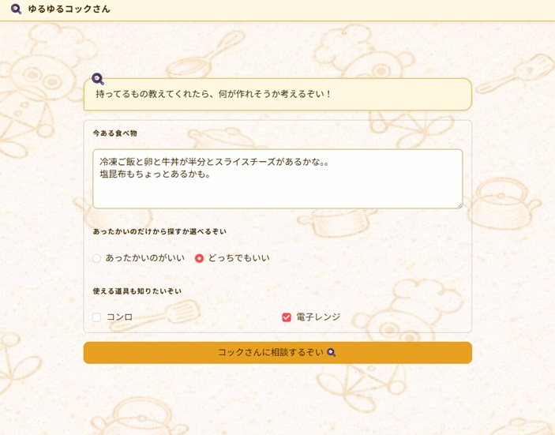

# 🍳 ゆるゆるコックさん

> 今ある食材を入力するだけで、AIがありもので作れる料理を提案してくれるアプリ。

[](https://yuruyuruchef.streamlit.app/)

 

---

## 📋 アプリ概要

「冷蔵庫にあるもので何か作りたいけど、レシピが思い浮かばない」を AI で解決するツールです。

食材を入力するだけで、ゆるゆるコックさんがありもので作れる料理を提案。マッチ率が低くても全力肯定で「まあまあパスタぽいのん（ツナ缶入り）」などと提案してくれます。モバイル対応済みなので、買い物前や夕飯時にサクッと使えます。

**🔗 デモ：https://yuruyuruchef.streamlit.app/**

---

## ✨ 主な機能

| 機能 | 説明 |
|------|------|
| 🥦 食材入力 | 自由テキストで食材を入力（表記ゆれ・料理名もOK） |
| 🤖 AI正規化 | Groq AI が食材を正規化（「シーチキン→ツナ缶」「牛丼→牛肉・玉ねぎ・ご飯」など） |
| 🍳 レシピ提案 | ChromaDB のベクトル検索で食材カテゴリに合うレシピを提案 |
| 📊 マッチ率表示 | 本物の食材との一致率を表示（20%でも全力肯定） |
| 🔄 代替食材対応 | 本物の食材がなくても代替食材で手順を自動置き換え |
| 🍽️ 作り方説明 | 手持ちの食材名入りで調理手順をセリフ生成 |
| 📋 シェア機能 | 作り方テキストをクリップボードにコピー |

---

## 🖥️ 画面構成

```
【画面①：トップ】
食材入力（テキストエリア）
温度設定・道具選択
　↓
「相談するぞい」ボタン
　↓
【画面②：提案】
マッチ率 ＋ 料理名（〇〇ぽいのん）＋ 食材解析セリフ
　↓
「作り方を説明するぞい」ボタン
　↓
【画面②-b：詳細】
調理手順 ＋ 調味料ヒント ＋ 食べ方ヒント
　↓
【画面③：お見送り】
お見送りセリフ ＋ シェアテキスト ＋ トップに戻る

※マッチ率0% または Groqエラー時 → 救済画面（買い物アドバイス表示）
```

---

## 🛠️ 技術スタック

| 要素 | 内容 |
|------|------|
| フレームワーク | [Streamlit](https://streamlit.io/) |
| AI | [Groq API](https://groq.com/)（llama-3.3-70b-versatile） |
| ベクトルDB | [ChromaDB](https://www.trychroma.com/)（paraphrase-multilingual-mpnet-base-v2） |
| 言語 | Python 3.11 |
| デプロイ | Streamlit Community Cloud |

---

## 💡 工夫したポイント

### 食材マッピングロジック
代替食材の割り当てに優先順位を設けている：
1. **完全一致**：ユーザーの食材 ＝ レシピの本物食材
2. **同カテゴリ代替**：肉系→肉系、野菜系→野菜系で置き換え
3. **主食系同士の代替**：パスタ→マカロニ、うどん→そばなど
4. **カテゴリ不問フォールバック**：それでも余った食材を順番に割り当て

### AIプロンプト設計
- Groq を4回に分けて呼び出し（食材正規化・調理手順・お見送りセリフ）、それぞれ責務を分離
- 調理手順生成は「料理名を渡さない」設計にして、Groqが学習知識で食材を元に戻すのを防止
- 食材正規化プロンプトに缶詰ルール（「ツナ→ツナ缶」）やひき肉ルールを明示

### データ設計
- `recipe_db.json`（59件）：加工手順に具体的な食材名を明示して置換ロジックが機能するよう設計
- `ingredient_db.json`（189件）：食材名・カテゴリ・生食可フラグを管理。短縮形・表記ゆれも登録

### UI / UX
- **全力肯定方針**：マッチ率が低くても「ほぼ無理やりだけど〇〇ぽいのん」と提案。ユーザーを止めない
- キャラクターの語尾は「〜ぞい」で統一。セリフはすべてGroq生成
- 同じ食材で「トップに戻る」すると別の料理を提案できる（直近履歴との重複を除外）

---

## 📁 ファイル構成

```
yuruyuru_chef/
│
├── app.py                        # メインアプリ（全画面・Groq連携・ChromaDB検索）
├── data/
│   ├── recipe_db.json            # レシピDB（59件）
│   └── ingredient_db.json        # 食材DB（189件）
├── assets/
│   └── kawaii_kokkusan_background_napkin_1600x900.jpg
├── .streamlit/
│   └── secrets.toml              # GROQ_API_KEY（GitHubには上げない）
├── setup_chroma.py               # ChromaDB初期化スクリプト
└── requirements.txt
```

---

## 🚀 ローカルで動かす

```bash
# 1. リポジトリをクローン
git clone https://github.com/yamawaki64-design/yuruyuru_chef.git
cd yuruyuru_chef

# 2. 依存パッケージをインストール
pip install -r requirements.txt

# 3. APIキーを設定
#    .streamlit/secrets.toml を作成して以下を記載
#    GROQ_API_KEY = "your_groq_api_key"

# 4. 起動
streamlit run app.py
```

> **Groq API キーの取得**：https://console.groq.com/ から無料で取得できます。

> **初回起動時**：ChromaDB のベクトルDBが自動構築されます（数分かかる場合あります）。

---

## 🔮 今後の検討事項

- [ ] スコアリング改善（カテゴリ一致率を評価軸に加える）
- [ ] レシピDB・食材DBの拡充
- [ ] 食材1品入力の最適化（そのまま使えるレシピを優先）
- [ ] 項目JSONの切り替えUI（和食特化・お弁当モードなど）

---

## 👤 作者

AI 実装 × ベクトルDB設計の掛け合わせを示すポートフォリオとして開発しました。

<!-- TODO: 名前・SNSリンク・Zenn記事URLなどを追記してください -->
<!-- - Zenn: https://zenn.dev/yourname -->
<!-- - Twitter/X: @yourhandle -->
